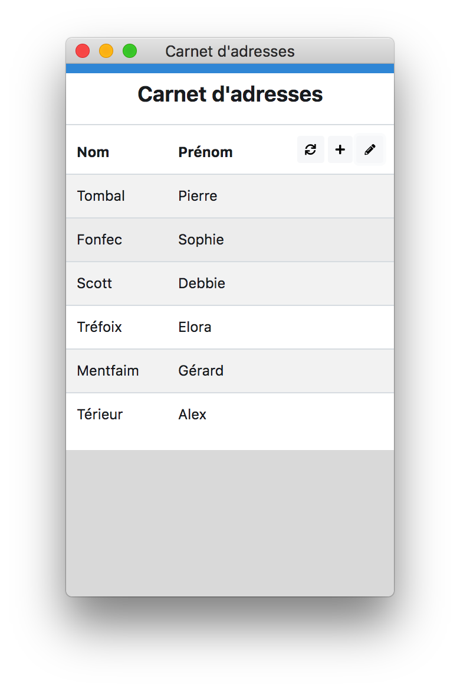
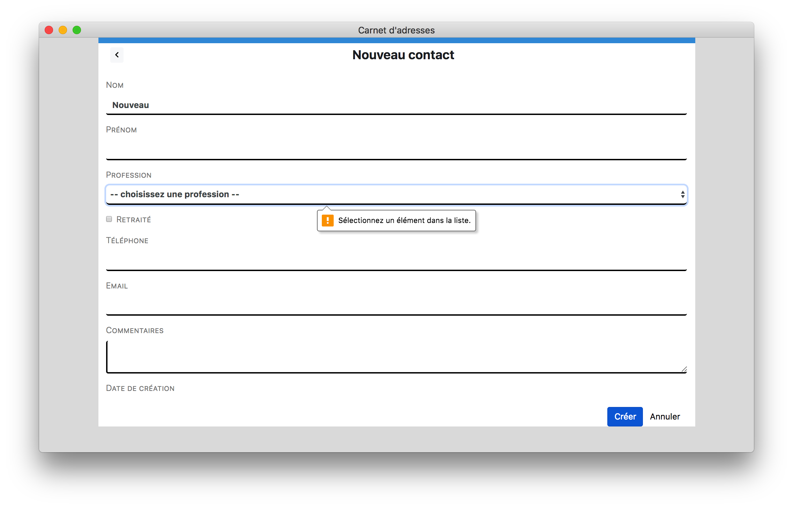

# 1. Introduction

Ce projet entre dans le cadre d'une étude de cas PHP/Symfony.

Il s'agit de créer une application de type carnet d'adresses.
Elle est composée d'une seule page, sans authentification.

L'intention est d'expérimenter :
- l'architecture orientée services, le style d'architecture REST, le chargement asynchrone a.k.a Ajax ;
- les abstractions implémentées dans Symfony : Entities, Migrations, Repositories, Controllers ;
- la validation des données côté serveur avec les Forms et les Entities ;
- l'ORM Doctrine ;
- les templates Twig ;
- les feuilles de styles en cascade et le responsive design ;
- les containers.

# 2. Installation

## 2.1. Démarrage de l'application

L'application a été conçue être facilement déployable dans n'importe quel environnement, qu'il soit local ou dans le cloud, sous Windows, Mac ou Linux.

Nous avons fait le choix de nous reposer sur Docker Compose afin d'automatiser intégralement le processus d'installation des différents containers composant la pile applicative, garantir les versions de logiciels utilisées, et éviter tout conflit avec les systèmes hôtes grâce aux containers.

Voici les étapes requises pour exécuter l'application :
- S'assurer d'avoir une version récente de Docker Engine et Docker Compose. La version communautaire suffit. Cette [documentation](https://docs.docker.com/compose/install/#install-compose) fournit toutes les indications pour chaque système d'exploitation.
- Cloner le [dépôt GitHub](https://github.com/jagathos/experiments.git) ou décompresser [l'archive contenant le code source](https://github.com/jagathos/experiments/archive/master.zip) dans un répertoire cible.
- Depuis une console, entrer dans le répertoire du projet avec `cd 20180814-PHP-Symfony` et exécuter la commande `docker-compose up`.

Exemple pour Linux ou macOS :
```
$ cd ~
$ git clone https://github.com/jagathos/experiments.git
$ cd ~/experiments/20180814-PHP-Symfony
$ docker-compose up
```
Cette opération peut durer plusieurs minutes selon la bande passante réseau disponible et la puissance de calcul de la machine hôte du fait des nombreux téléchargements et compilations qu'elle provoque.

Avant de pouvoir accéder à l'application, il faut attendre qu'une ligne similaire à celle ci-dessous apparaisse dans le shell :
```
webserver    | [Thu Aug 23 09:59:58.348728 2018] [core:notice] [pid 36] AH00094: Command line: 'apache2 -D FOREGROUND'
```

Il suffit alors de naviguer vers la page [http://localhost:8888](http://localhost:8888).

Sous macOS :
```
$ open http://localhost:8888
```
Le site a été validé avec Chrome, Safari et Opera.
Des différences de présentation ont été constatées avec FireFox.

## 2.2. Comment arrêter et désinstaller l'application

Pour arrêter l'application :
```
docker-compose down
```
Il est ensuite possible de supprimer les images. Pour cela, se référer à la documentation des commandes `docker image ls`, `docker image rm` et/ou `docker image prune`.

Ces opérations suppriment toute trace de l'application de la machine hôte à l'exception des sources et des données d'exécution. Pour les détruire et récupérer l'espace disque, il suffit de supprimer le répertoire dans lequel le dépôt a été cloné.

# 3. Fonctionnalités

L'interface a été pensée pour une utilisation sur un écran classique de grande taille aussi bien que sur périphérique mobile.

Exemple d'affichage sur un écran de petite taille :


Présentation sur un écran plus grand :


Les paradigmes d'interface ont été empruntés de iOS :
- Un clic sur un élément de la liste présentée au démarrage de l'application permet d'afficher les détails de la fiche contact, initialitement en lecture seule.
- Pour la modifier, il suffit de changer de mode en cliquant sur l'icone `crayon` en haut à droite.
- Le fait de cliquer de nouveau sur le crayon ou de valider les modifications à l'aide du bouton `Enregistrer` provoque un retour en mode lecture seule.
- Pour ajouter un nouvel enregistrement, il suffit de cliquer sur l'icpne `+` depuis l'écran principal.
- La suppression s'opère en cliquant sur le `crayon`puis sur la poubelle présentée en regard du contact souhaité. Une confirmation n'est demandée que si un clic en dehors de la corbeille est détecté. Le mode suppresssion prend fin lorsque l'on clique de nouveau sur le `crayon`.

Ces étapes sont illustrées [ici](doc/screenshots/README.md) avec de nombreuses autres [captures d'écran](doc/screenshots/README.md).

# 4. Architecture

Nous avons choisi de réaliser le site sous la forme d'une "Single Page Application":
- Le frontend est construit à l'aide de HTML/JavaScript/Twitter Bootstrap. Une page HTML unique dépourvue de données et contenant l'intégralité les éléments d'interface -initialement invisibles- est chargée de puis le serveur web.
- Une fois le code JavaScript initialisé, il soumet des requêtes Ajax à un web service REST s'appuyant sur le framework PHP Symfony.
- Nous utilisons [JQuery](https://jquery.com/) pour la manipulation du DOM.
- Pour faciliter les échanges de données entre vue et modèle, nous avons également recours à [Knockout.js](http://knockoutjs.com/) qui facilite le data binding.
- Les données sont stockées dans une instance MariaDB.

Cette logique est répartie dans 2 containers différents :
- Un premier container nommé `database` contient le code de [MariaDB](https://hub.docker.com/_/mariadb/). Il est configuré à l'aide de variables d'environnement (nom de la base de données, utilisateurs, mots de passe). Par ailleurs, un dossier de la machine hôte est monté sur `/var/lib/mysql` afin de persister les données produites à l'exécution. Le même mécanisme est utilisé pour injecter les données initiales de test.
- Un second container `webserver` contient l'environnement de développement et de production. Il est basé sur une image [Apache/PHP](https://hub.docker.com/_/php/) qui a été spécialisée tel que nous le décrirons plus bas.

Pour entrer dans le container `webserver` et examiner l'application de l'intérieur ou exécuter les outils de développement, il suffit soumettre la commande suivante :
```
docker-compose exec webserver /bin/bash
```

# 5. Modèle de données

Dans la mesure où chaque contact possède une référence obligatoire à une profession et que la liste de celles-ci doit pouvoir être mise à jour facilement, nous avons choisi de les stocker dans une table dédiée.

La base de données contient par conséquent 2 tables :
- `person` contient les données de chaque contact ;
- `occupation` décrit les professions reconnues.

Ces deux entités sont liées par une relation `ManyToOne` qui fera l'objet d'une déclaration spécifique dans le mapping ORM Doctrine.
```
    /**
     * @ORM\ManyToOne(targetEntity="App\Entity\Occupation")
     */
    private $occupation;
```
Nous avons extrait de la feuille Excel fournie 2 colonnes distinctes : le nom libellé de la profession `displayname` et l'`url` pointant sur sa fiche descriptive. 
Nous n'utilisons pas actuellement cette dernière information, mais elle pourrait servir à implémenter une aide contextuelle.

Voici une visualisation du modèle physique réalisée à l'aide de [DataGrip](https://www.jetbrains.com/datagrip/).


Chaque entité possède un identifiant `id` dont la colonne est déclarée automatiquement par la commande `bin/console make:entity`. C'est cette propriété qui permet de réaliser la jointure entre les 2 tables.

Le champ `creationtimestamp` fait l'objet d'un traitement particulier dans le contrôleur `PersonController` et dans l'interface graphique car il n'est pas supposé être saisi par l'utilisateur final mais généré par le serveur.

Enfin, la table `migration_versions` est technique, maintenue par les commandes `console doctrine:migrations:migrate` par exemple.

# 6. Données de test et dump de la base de données

Le container MariaDB est automatiquement initialisé avec un jeu de données de test lors de son premier démarrage.

Un [dump de la base de données](mariadb-initdata/dump.sql) est disponible dans le code source [ici](mariadb-initdata/dump.sql).


# 7. API REST

Outre la route primaire `GET /` qui retourne la structure HTML de l'unique page de l'application, le serveur web réagit à d'autres routes destinées à gérer les entités persistantes.

Elles peuvent être listées par la commande `bin/console debug:router`.

|Nom de la route|Méthode|Chemin|Tester|Commentaires|
|:-------------:|:-----:|:----:|:----:|:----------:|
|occupation_index|GET|[/occupations](http://localhost:8888/index.php/occupations)|[Lien](http://localhost:8888/index.php/occupations)|Produit la liste de toutes les professions|
|person_index|GET|[/persons](http://localhost:8888/index.php/persons)|[Lien](http://localhost:8888/index.php/persons)|Retourne l'ensemble des contacts|
|person_create|POST|/persons||Permet d'ajouter une nouvelle entrée à la collection de personnes|
|person_read|GET|[/persons/{id}](http://localhost:8888/index.php/persons/1)|[Lien](http://localhost:8888/index.php/persons/1)|Retourne la fiche complète d'une personne identifiée|
|person_update|PUT|/persons/{id}||Permet de mettre à jour l'enregistrement spécifié|
|person_delete|DELETE|/persons/{id}||Supprime une entrée de la collection de personnes|

Dans tous les cas, le payload est formaté en json.

# 8. Détails d'implémentation

## 8.1. Structure globale du dépôt de sources

|Dossier|En source control|Contenu|
|:-----:|:---------------:|:-----:|
|doc|oui|Ressources utilisées dans le présent README|
|mariadb-initdata|oui|Données de test sous la forme d'un `.sql` produit par `mysqldump`|
|mariadb-storage|non|Ce dossier initialement inexistant et ignoré par `.gitignore` est destiné à recevoir les fichiers créés par MariaDB lors de son exécution|
|scripts|oui|Scripts shell Linux destinés à simplifier certaines manipulations occasionnelles telles que le dump de la base de données sans entrer manuellement dans le container correspondant|
|webserver-htdocs|oui|C'est le projet web / Symfony proprement dit|
|webserver-image_php_config|oui|Contient les fichiers de configuration PHP optimisés pour Symfony|
|webserver-opt|oui|Dossier monté dynamiquement dans le container Apache/PHP. Contient l'exécutable de `composer` utilisé pendant la phase de développement|

Outre ces dossiers, on trouve également à la racine :
- `docker-compose.yml` : contient les instructions `docker-compose` permettant de créer, configurer et interconnecter les services base de données et serveur Apache/PHP.
- `webserver-image_dockerfile.yml` : si l'image Docker utilisée pour la base de données est standard, ce n'est pas le cas du serveur web/PHP qui a dû être adapté pour y inclure les pré-requis de l'environnement de développement. Ainsi, rien n'a été installé sur la machine hôte utilisée lors du déroulement du projet. Le développement a été intégralement réalisé en exécutant `composer` et `console` directement à l'intérieur du container `webserver`.

## 8.2. Focus sur la web app, à l'intéreur du dossier `/webserver-htdocs`

La structure du projet contenu dans le dossier webserver-htdocs ayant été générée par `composer create-project symfony/website-skeleton addressbook`, l'organisation des dossiers est standard.

|Chemin|Commentaires|
|:----:|:----------:|
|addressbook|Le dossier racine produit par `composer create-project ...`|
|addressbook/bin|Les binaires de Symfony. Contient entre autre l'utilitaire `console`|
|addressbook/composer.json|Fichier de configuration du projet maintenu par Composer|
|addressbook/public/|Contient uniquement les CSS/ et JS/ de l'application|
|addressbook/src/Entity|Les entités `Occupation` et `Person`|
|addressbook/src/Repository|Les repository objects permettant aux controllers de d'accéder aux entités|
|addressbook/src/Controller|Les contrôleurs `HomeController`, `OccupationController` et `PersonController`|
|addressbook/src/Form|Ne contient qu'un seul formulaire `PersonType`|
|addressbook/templates|Contient l'unique template de notre Single Page Application|
|addressbook/vendor|Lors du premier démarrage du container, les fichiers des différents bundles utilisés par l'application seront installés dans ce dossier ignoré par `.gitignore`. En effet, `docker-compose up` provoquera l'exécution de la commande `composer install` lorsque la pile applicative sera initialisée|

## 8.3. ORM et validation côté serveur

L'application repose sur plusieurs mécanismes de validation.

Un premier contrôle est réalisé côté client par le formulaire HTML/JavaScript.

Le système reposant sur une API susceptible d'être invoquée directement sans passer par l'interface graphique, un second contrôle est effectué par le contrôleur `PersonContoller` lors de chaque soumission de données. Nous utilisons pour cela le service de validation proposé par Symfony et qui s'appuie sur des annotations spécifiques ajoutées aux classes, propriétés ou accesseurs des entités.

Par exemple, voici comment le serveur s'assure qu'au moins l'un des champs email et téléphone est renseigné, dans `Entity\Person.php` :
```
    /**
     * @Assert\IsTrue(
     *    message = "L'email ou le téléphone doit être renseigné"
     * )
     */
    public function hasPhoneOrEmail(): bool {
        return $this->email || $this->telephone;
    }
```

A l'aide de `ValidatorInterface::validate`, le contrôleur `PersonController` s'assure que toutes les contraintes soient bien respectées avant d'invoquer les méthodes de persistance de l'EntityManager.
En cas d'erreur, il collecte tous les messages et les formate avant de les retourner au client via l'objet `Response`.

Enfin, la base de données est susceptible de détecter et rapporter des violations de contraintes. Tous les messages de validation produits par le serveur sont remontés aux client afin que l'utilisateur puisse diagnostiquer les problèmes.

Démonstration de la validation côté client :


Exemple de message de validation issu du serveur :


## 8.4. Particularités des contrôleurs HomeController et PersonController

Une spécificité réside dans le fait que le formulaire de création et de modification des personnes est généré par le contrôleur `HomeController` qui le rend via un template Twig, à destination de l'appllication SPA/Ajax.

Le formulaire ainsi produit est initialement masqué, puis configuré dynamiquement et présenté en fonction du flux d'exécution :
- lors de l'affichage des détails d'un contact, les boutons submit et cancel sont masqués ;
- pour créer un nouvel objet, le formulaire doit provoquer une requête POST ;
- pour modifier un objet existant, le formulaire doit générer un PUT sur une url différente et passer l'id de l'objet cible en paramètre.

Dans tous les cas, les données soumises par le formulaire client sont traité par le contrôleur `PersonController`, contrairement au workflow classique.

Les avantages de ce design sont les suivants :
- Après la phase d'initialisation pendant laquelle le code HTML, JavaScript et CSS est transmis au navigateur, seules des données transitent sur la connexion. Ceci permet de réduire le trafic et améliore les performances.
- Il conduit à une séparation claire entre présentation et données.
- La réactivité perçue est améliorée car toutes les requêtes sont traitées de façon asynchrone.

# 9. Défis

- Une application classique peut être produite très rapidement à l'aide des générateurs Symfony (`console make:entity`, `console make:controller`, `console make:form`, etc.). Ce n'est pas le cas lorsque la cible est une Single Page Application.
- Utiliser la même Form pour créer et mettre à jour des instances de Person via l'API suppose le recours à 2 verbes HTTP différents (respectivement POST et PUT). Il est nécessaire de spécifier la méthode au moment de l'instanciation du formulaire dans le controller. A défaut, le formulaire n'est jamais considéré comme valide et la requête échoue (`Form::isSubmitted()` retourne toujours `false`). Cette contrainte est mal documentée et les problèmes qu'elle engendre sont la source de nombreuses questions, rapports de bugs et finalement perte de temps au moins lors de la première expérience.
- Les routes générées par défaut ne sont pas tout à fait conformes aux canons REST (par exemple /person/new et /person/{id}/update pour la création/mise à jour d'une entité au lieu de /persons).


# 10. Limitations et prochaines étapes

Hormis les aspects fonctionnels volontairement limités, nous pouvons mentionner quelques restrictions techniques liées aux contraintes de temps du projet :
- Tous les éléments du carnet d'adresse sont intégralement chargés ce qui limite la scalabilité. Il serait judicieux d'implémenter un paging transparent.
- L'ensemble des professions est automatiquement envoyé au client via la définition du formulaire dès le chargement de la page principale. Pour augmenter la réactivité du site, les entités `Occupation` auraient pu être téléchargées de façon asynchrone car elles ne sont pas utiles tant que le formulaire n'est pas effectivement présenté.
- Pas de route côté client => tout refresh du navigateur entraîne la perte du contexte de l'application.
    Solution : il serait aisé d'ajouter le support de hash navigation avec le framework leger [Sammy.js](http://sammyjs.org/).
- Séparation de responsabilités : dans ce prototype rapide, elle n'est pas tout à fait respectée. Par exemple, la classe PHP PersonType (formulaire côté serveur) ne devrait pas faire référence aux event handlers JavaScript. Il aurait été plus propre (mais aussi plus long) d'assigner des identifiants à chaque champ côté PersonType et réaliser dynamiquement le binding côté JavaScript dans un style *unobtrusive JavaScript*.