# Captures d'écran

Les principaux états de l'interface ont été capturés pour illustrer les points mentionnés dans la documentation du projet.

Ecran d'accueil
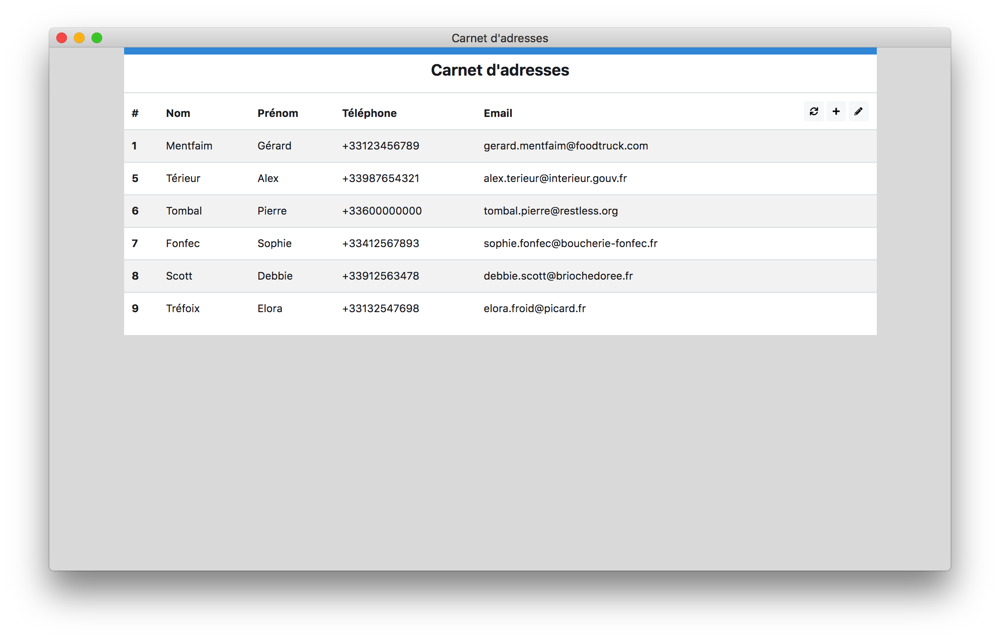

Chargement en mode Ajax
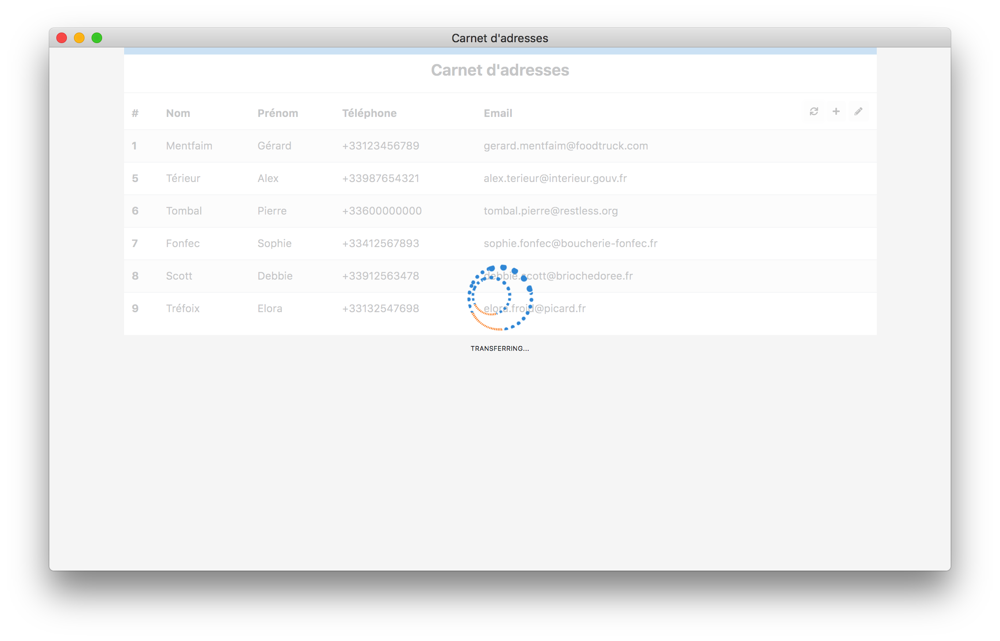

Détails d'un contact
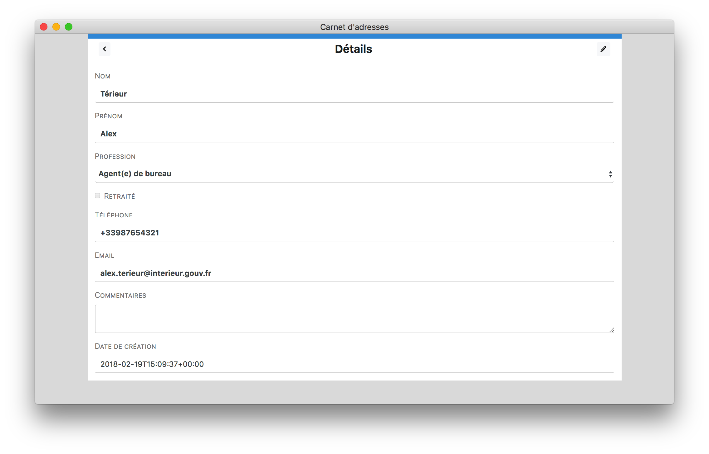

Modification d'un contact et confirmation d'annulation
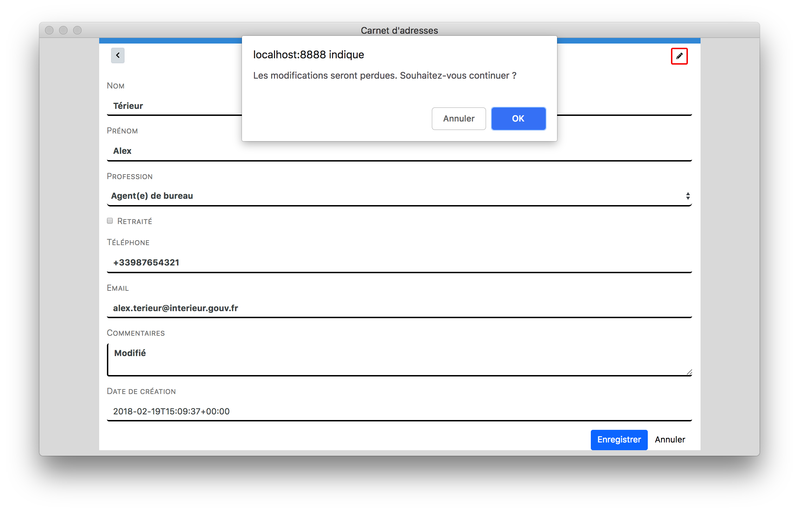

Modification d'un contact et confirmation de sauvegarde
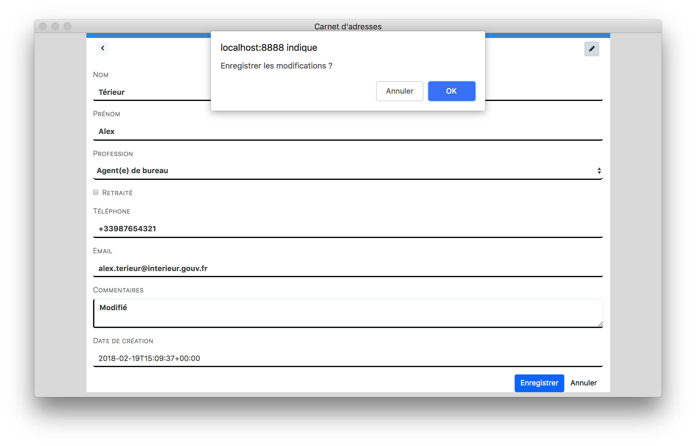

Création d'un nouveau contact et validation côté client
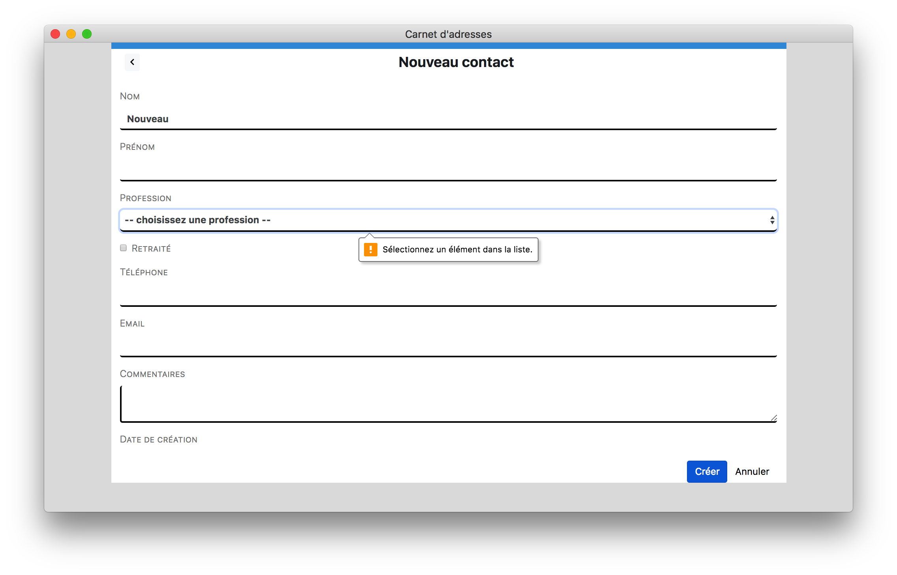

Création d'un nouveau contact - validation côté serveur
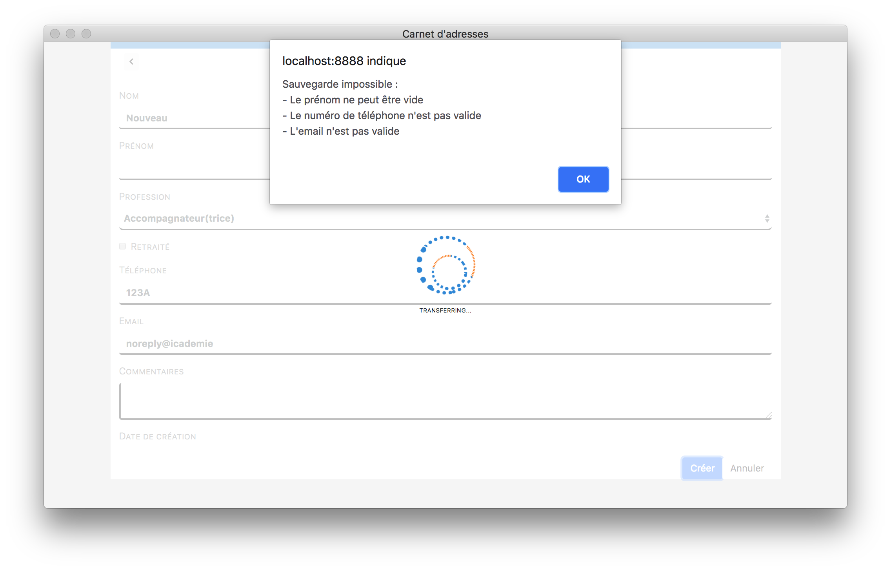

Suppression de contacts
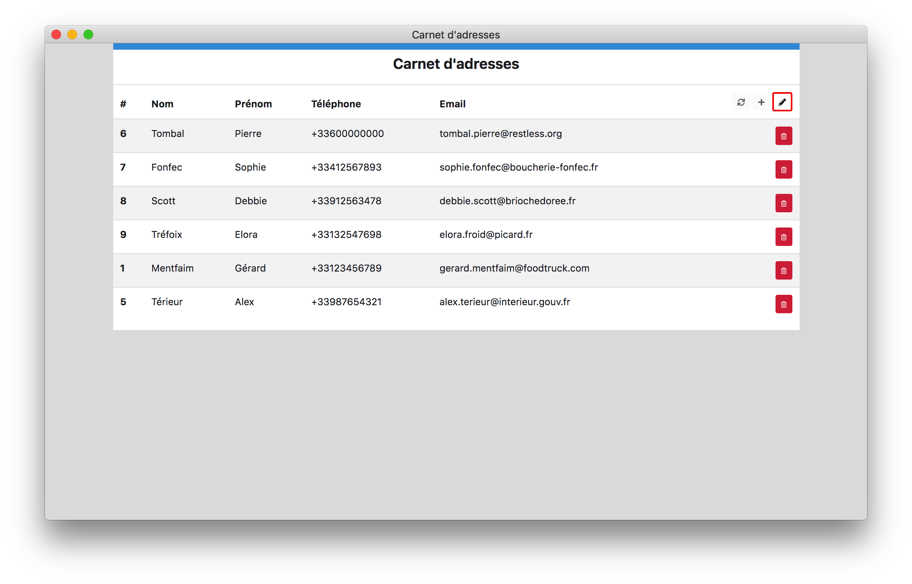

Confirmation de suppression
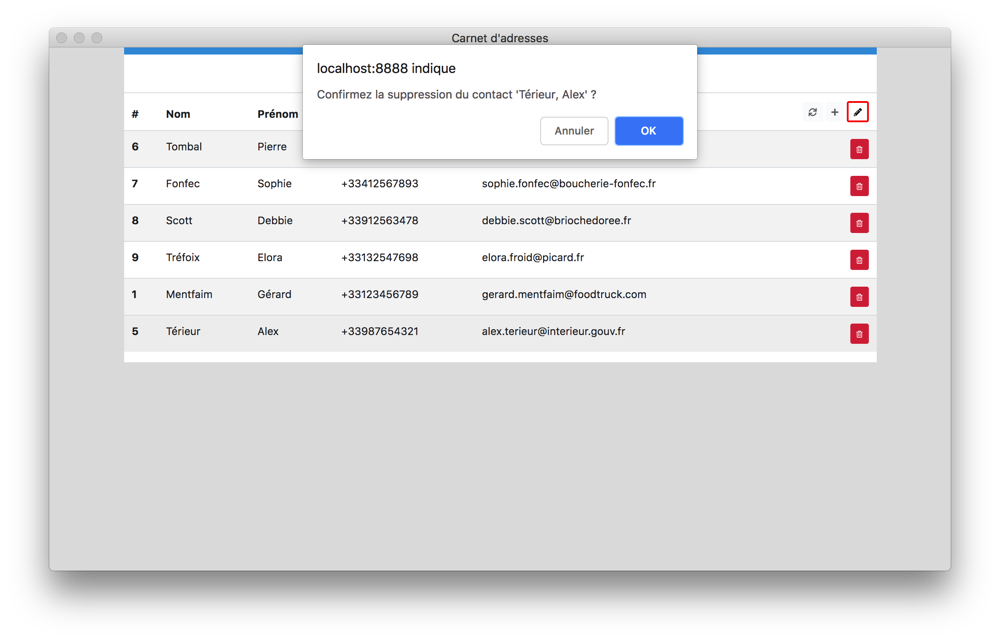

Responsive-Petit écran
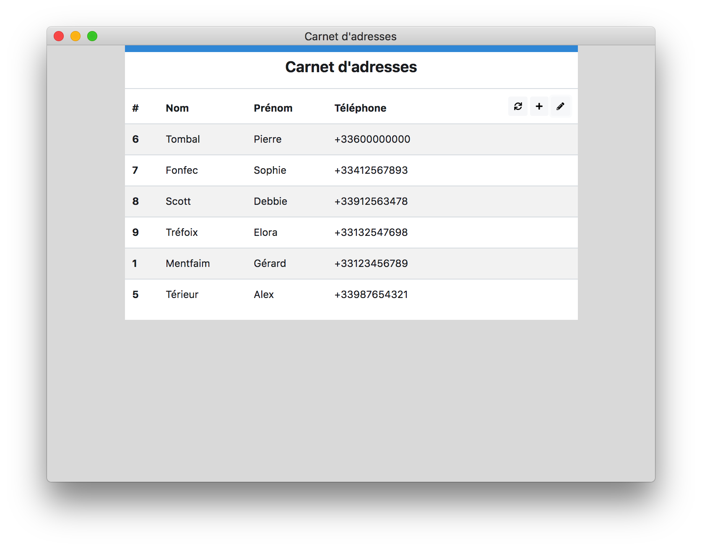

Responsive-Tablette
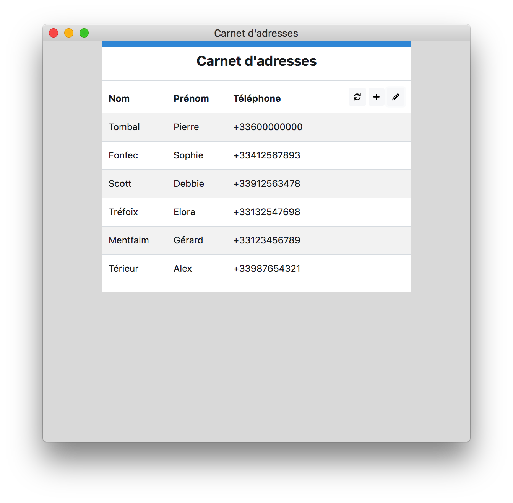

Responsive-Téléphone
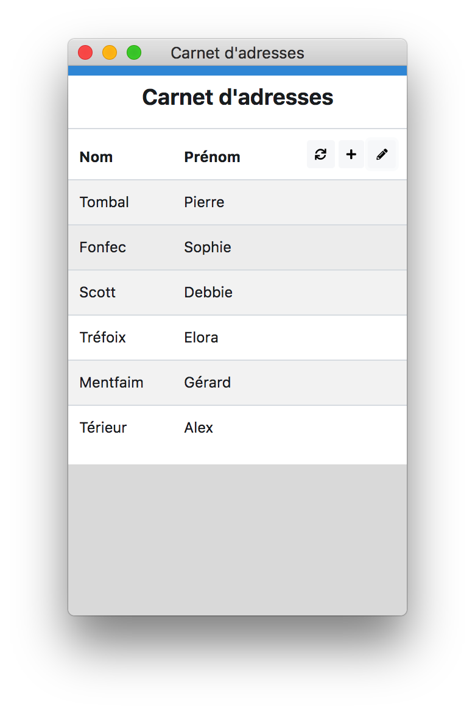
